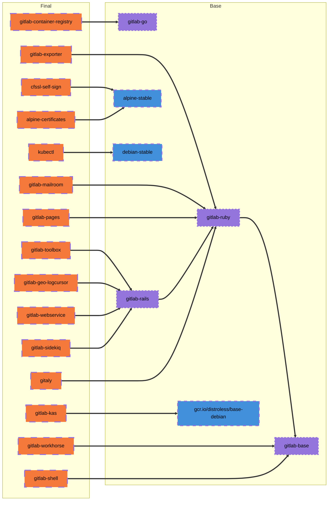
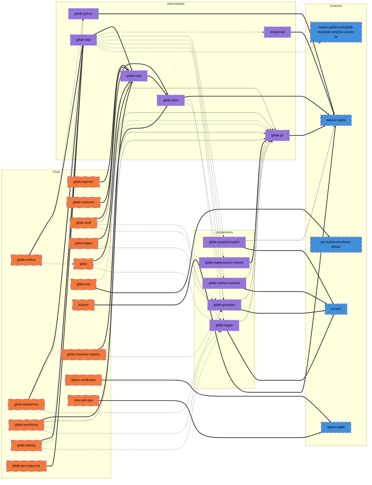

[[_TOC_]]

# Building Images

Building these images is done through GitLab CI. By default triggering a CI
build will use the latest upstream gitlab master, and build both gitlab-ce and
gitlab-ee versions.

For releasing new versions, the repo gets tagged by the corresponding GitLab
version by `release-tools` and the tag pipeline running on the dev.gitlab.org
mirror of the project will build the images and push them to dev registry. At
the time of publishing, these images will be copied to the com registry and
hence will be available to the public to use.

## Dependency Proxy

When the variable `DEPENDENCY_PROXY` is set, it will be prefixed to the name of any image which
is pulled from dockerhub.com. To work properly, the variable should be set with the trailing `/`.
The images which currently use this are:

1. alpine-certificates
1. cfssl-self-sign
1. gitlab-python
1. kubectl
1. postgresql

## Manually triggering the pipeline for a reference

If manual run of the pipeline needs to be done in order to build/rebuild a particular ref of GitLab,
the build needs to be triggered in this repo's GitLab project with the following variables:

|Variable|Description|Examples|
|--------|-----------|--------|
|`GITLAB_VERSION`|The GitLab ref name used to download the source code. For tags it should be the tag name.|`v11.8.0-ee`, `master`|
|`GITLAB_ASSETS_TAG`|This is used for fetching the js/css assets, and must be the slug version of the *GITLAB_VERSION*.|`v11-8-0-ee`, `11-8-stable-ee`|
|`GITLAB_TAG`|Only provided when the GitLab version is a tagged version. When set this is the tag name.|`v11.8.0-ee`|
|`GITLAB_REF_SLUG`|This is used as the docker label when the new images are built. For tags, this is the tag name. For branches, this is typically the slug version of the branch.|`v11.8.0-ee`, `my-test`|
|`GITALY_SERVER_VERSION`|The version of gitaly to build. This needs to be a tag reference that matches what is in the *GITALY_SERVER_VERSION* file in the version of GitLab being built.|`v1.12.0`|
|`GITLAB_SHELL_VERSION`|The version of gitlab-shell to build. This needs to be a tag reference that matches what is in the *GITLAB_SHELL_VERSION* file in the version of GitLab being built.|`v8.4.4`|

The list above is not comprehensive. Refer to the correlated pipeline jobs for
any additional variables that may need to be specified at build time. Keep in
mind that dependencies of that component may also require their own additional
variables.

### Functional Example

Let's say we want to build a target version of the rails application.  Let's
randomly pick
[`32916ac2169`](https://gitlab.com/gitlab-org/gitlab/-/commit/32916ac21690c9f2e94c1c30fbbb28bca44a9ac4).
We can kick off a pipeline with variable `GITLAB_VERSION` set to the
aforementioned `sha`.  This only changes the rails code base, and does not
impact any other component.  Reference the file
[`ci_files/variables.yml`](../ci_files/variables.yml`) as reference as to what
will build if left undefined.  **All variables set inside of CI overwrite what
is configured in this _repo_ at build time.**  The content of `*_VERSION` in the
`gitlab-org/gitlab` repo does **NOT** influence what component versions will be
built.  If you need a target component to match a given GitLab version, the
associated variable for that component **MUST** also be set.

**For CE:**

The following variable should be present for a CE build:

- `CE_PIPELINE` - set to `true`


**For EE:**

The following variable should be present for a EE build:

- `EE_PIPELINE` - set to `true`


If the above variable is not present, by default CNG will attempt a `CE` build.
There are quite a few rules that feed into this, this can be found in the
[`rules.gitlab-ci.yaml`](https://gitlab.com/gitlab-org/build/CNG/-/blob/1c36c9eb6815b29a2aa0fc4494563ac56690ee7c/.gitlab/ci/rules.gitlab-ci.yml#L71-121)

## CI variables

See separate document on the [available ci variables](ci-variables.md).

## Post CI Build Image Introspection

Image tagging is a bit complex.  Thus determining what went into said image is a
also complex, but finding the information has been made easy for us.  Basic
guidelines;

* A CI Pipeline that is part of a tagged build, will receive that tag name.  If
  we tagged CNG for version `v15.4.0`, all final images will be tagged as such.
* A CI pipeline that is part of Auto-Deploy - all final images will be tagged in
  accordance to the information sent via `release-tools`.  These are normally
  something like: `15-5-202210061220-80de0d60905`, which is formatted
  `<major>-<minor>-<timestamp>-<gitlab_sha>`.
* A build triggered manually - all final images will be tagged with a `sha` that
  is calculated, see
  [`build.sh`](https://gitlab.com/gitlab-org/build/CNG/-/blob/1c36c9eb6815b29a2aa0fc4494563ac56690ee7c/build-scripts/build.sh#L138)
  for some of the details that goes into this.
  * Some of the information that is used into building the tag `sha` is
    determined by the build job.  Refer to the appropriate build job being
    investigated as defined in
    [`common.gitlab-ci.yml`](https://gitlab.com/gitlab-org/build/CNG/-/blob/master/.gitlab/ci/common.gitlab-ci.yml)
  * For FIPS specific builds, final images tags will be suffixed with `-fips`
  * For UBI specific builds, final image tags will be suffixed with `-ubi8`

Each job produces an artifact that denotes the tag name.  This is far easier
than interrogating the CI job log output.  The artifacts contain small bits of
information, but importantly, they'll contain a line that represents that tag
name leveraged for the given image.

### Functional Example

Using my example build from above, we landed with an image that was tagged like
so:

```
<SNIP from `gitlab-webservice-ee` CI Job Logs>
Successfully built 2610220ad3c5
Successfully tagged registry.gitlab.com/gitlab-org/build/cng-mirror/gitlab-webservice-ee:309c11e03a2733c265cd047ed71a9dc6d5c056cb
Final Image Size: 2116596332
<SNIP>
```

The contextual information we need for the image tag is also dropped in the
artifacts as mentioned already.  If we browse to
`artifacts/images/gitlab-webservice-ee.txt`, we see the following:

```txt
gitlab-webservice-ee:309c11e03a2733c265cd047ed71a9dc6d5c056cb
gitlab-webservice-ee:master
```

So we can download that tag directly and validate that the version of GitLab
built matches our intention

```
% docker run -it --rm registry.gitlab.com/gitlab-org/build/cng-mirror/gitlab-webservice-ee:309c11e03a2733c265cd047ed71a9dc6d5c056cb cat /srv/gitlab/REVISION
Unable to find image 'registry.gitlab.com/gitlab-org/build/cng-mirror/gitlab-webservice-ee:309c11e03a2733c265cd047ed71a9dc6d5c056cb' locally
309c11e03a2733c265cd047ed71a9dc6d5c056cb: Pulling from gitlab-org/build/cng-mirror/gitlab-webservice-ee
<SNIP>
Digest: sha256:769faa4f0c394016df0cc787a3d2e4708d011e9e55d97e9ae7c2349dbed9da35
Status: Downloaded newer image for registry.gitlab.com/gitlab-org/build/cng-mirror/gitlab-webservice-ee:309c11e03a2733c265cd047ed71a9dc6d5c056cb
Begin parsing .erb templates from /srv/gitlab/config
Begin parsing .tpl templates from /srv/gitlab/config
32916ac2169
```

Which of course matches the `ref` I used to kick off the build.  Note that
getting the version will differ for each image.  Refer to that target project
for ways to grab that information.

Use caution when using the `final-image-listing`.  These refer to the tags of
the images per guidance above.  Thus we can rely on these tags for items such as
Auto-Deploy or tags for releases.  However, we cannot correlate the tag of the
image with any `ref` to the component being built.  Images that are tagged with a 
branch name refer to the name of the CNG branch and NOT the branch of the
component being built.

## UBI images

We provide [UBI](https://www.redhat.com/en/blog/introducing-red-hat-universal-base-image)
images for GitLab components using separate Dockerfiles. These images follow a slightly
different build and release process, detailed below.

### Context

UBI images are provided by creating **Dockerfile.build.ubi8** and/or **Dockerfile.ubi8** files in the
CNG repository for the given component, alongside the standard **Dockerfile**.

- **Dockerfile.build.ubi8** files are required when accessing dependencies over the internet.
- **Dockerfile.ubi8** files are required when creating a final image for use in Kubernetes.
    - If dependencies from the internet are required, they will be pulled from the image
      created from **Dockerfile.build.ubi8**.

The presence of these files will trigger the UBI image build, given one of the following conditions is met:

- The pipeline is running for a tag ending in `-ubi8`, or
- The pipeline is running for a branch name ending in `-ubi8`, or
- The pipeline is running with an environment variable matching `UBI_PIPELINE='true'`

If one of these conditions is met, additional pipeline jobs and stages will
appear and the UBI images will be built and pushed into the GitLab registry.
The final job will submit the images to Red Hat for certification for the
OpenShift environments.

This certification job executes `build-scripts/redhat_certification.rb` and
requires the variable `REDHAT_API_TOKEN` to be declared. This variable is set
to the personal token generated on the [Connect portal](https://connect.redhat.com/key-manager).
The token used by GitLab CI is stored in the 1Password Build vault under the
"Red Hat Certification Token" entry.

The script allows the variable `GITLAB_REGISTRY_BASE_URL` (base URL where the
CNG images reside) can be defined to override the default location of where
the CNG image can be pulled from when submitting the scan requests.

The certification job can be manually triggered by setting
`REDHAT_CERTIFICATION` to "true" in a pipeline. Note: One may need to also
set `UBI_PIPELINE` to "true" to generate the UBI images.

In addition, it is possible to run the `build-scripts/redhat_certification.rb`
script to query the Red Hat API for the status of scan requests that have
been submitted. Executing `build-scripts/redhat_certification.rb -s` will display
a list of images and their current status in the Red Hat certification
pipeline. One would need to define `REDHAT_API_TOKEN`in the local environment
or use the `--token` command line switch to specify their personal token.

#### Certifying containers

Follow the steps below to complete the one-time setup of a container
project listing with RedHat:

1. Navigate to the [RedHat Partner Connect portal](https://connect.redhat.com/projects/create/containers).
1. Click **Create Project**.
1. Select **Red Hat OpenShift** under the **What platform do you want to certify on?** heading.
1. Select **Container image** under the **What do you want to certify?** heading.
1. Fill in the relevant project name (for example, `gitlab-pages`).
1. Select **Red Hat Universal Base Image** under the **OS Content Type** heading.
1. Select **Non-RedHat Container registry** under the **Distribution Method** heading.
1. Click **Create**.
1. Fill in the metadata under the **Settings** tab. Use one of the other container project pages as a reference.
1. Complete the **Pre-certification Checklist**:
   - The **Provide details about your container** step is mostly done by hand. However,
     the **Repository path** field is only filled in when submitting the image for certification.
   - The **Submit your container for verification** step is completed when the certification passes. If it
     fails for any reason, this step will remain incomplete.
   - For the remaining steps, follow the RedHat-provided instructions and refer to other
     project listings when necessary.
1. Copy the **PID** value on the following page, and add it to [redhat-projects.yaml](../redhat-projects.yaml).
1. Ensure a job to certify the image exists in the [UBI CI configuration](../.gitlab/ci/ubi.gitlab-ci.yml).

##### Test certification locally

Test image certification locally using the **preflight** utility.

The following example tests the KAS image:

```shell
docker run -it --rm registry.gitlab.com/gitlab-org/cloud-native/preflight:1.2.1-1 \
  preflight check container registry.gitlab.com/gitlab-org/build/cng/gitlab-kas:master-fips
```

##### Submit certification locally

If you need to submit for certification locally rather than via the pipeline, complete the following:

1. Create a personal access token under your GitLab account with **read registry** access.
1. Create a [RedHat API key](https://connect.redhat.com/account/api-keys).
1. Run the following:

   ```shell
   docker run --rm -it registry.gitlab.com/gitlab-org/cloud-native/preflight:1.2.1-1 bash
   podman login --username <gitlab email address> --password <GitLab personal access token> registry.gitlab.com
   preflight check container \
       registry.gitlab.com/gitlab-org/build/cng/gitlab-kas:master-fips \
       --submit \
       --certification-project-id="<PID from container project page, without `ospid-` prefix>" \
       --pyxis-api-token="<RedHat API key>" \
       --docker-config /run/containers/0/auth.json
   ```

After these steps, ensure that the added certification job passes in CI. Note that the certification
jobs rely on the **REDHAT_API_TOKEN** variable, which is "protected" and therefore only available for
jobs running on protected references, such as **master** and tags.

### Offline builds

UBI-based images can be built in an isolated environment with limited access to the internet.
In such an environment, the build scripts must download the binary dependencies from
[GitLab CNG Releases](https://gitlab.com/gitlab-org/build/CNG/-/releases). They also need
access the official UBI software repositories.

To build the UBI-based images in an isolated/controlled environment you need to download,
verify, and extract binary dependencies into Docker build contexts. Docker build instructions
for UBI-based images assume that these dependencies are placed in the right locations in the
Docker build context. Failing to do so breaks the build process.

The helper scripts in `build-scripts/ubi-offline/` directory help you with offline build.

`prepare.sh` downloads, verifies, and extracts the binary dependencies into the right places.
It ensures that all required dependencies for building UBI-based images are available in
the Docker build context. You can run this script from any location. To use it, you need to
pass the release tag, e.g. `prepare.sh v12.5.0-ubi8`. This script uses `curl`, `gpg`, and `tar`
commands.

`build.sh` builds all UBI-based images in the order that is described above. It logs the Docker
build output in `.out` files and keeps track of the failed images in `failed.log` . You can run
this script from any location however it always logs the outputs in `build-scripts/ubi-offline/build`.
Please note that you need to run `prepare.sh` before running this script.

`cleanup.sh` removes all the cached binary dependencies and log files that were generated or
downloaded by `prepare.sh` and `build.sh`. Same as the other two scripts you you can run this
script from any location.


## Build stages

The CNG images are built in multiple stages. Not all images are final images
because some are created as a common base for images built in a later stage. The
following list shows the stages and the purpose of the image. Images within a
single stage may build concurrently because they are independent of each other.

**Stage 0**
  * alpine-stable (intermediate)
  * debian-stable (intermediate)
  * gitlab-go (intermediate)

**Stage 1**
  * alpine-certificates (final)
  * cfssl-self-sign (final)
  * gitlab-gomplate (intermediate)
  * gitlab-graphicsmagick (intermediate)
  * gitlab-logger (intermediate)
  * gitlab-python(intermediate)
  * kubectl (intermediate, final)
  * postgresql (intermediate)

**Stage 2**
  * gitlab-base (intermediate)

**Stage 3**
  * gitlab-exiftool (intermediate)
  * gitlab-ruby (intermediate)

**Stage 4**
  * gitaly (final)
  * gitlab-container-registry (final)
  * gitlab-elasticsearch-indexer (intermediate)
  * gitlab-exporter (final)
  * gitlab-kas (final)
  * gitlab-mailroom (final)
  * gitlab-metrics-exporter (intermediate)
  * gitlab-pages (final)
  * gitlab-shell (final)

**Stage 5**
  * gitlab-rails-ee (intermediate)

**Stage 6**
  * gitlab-geo-logcursor (final)
  * gitlab-sidekiq-ee (final)
  * gitlab-toolbox-ee (final)
  * gitlab-webservice-ee (final)
  * gitlab-workhorse-ee (final)

Final images are identified by a comment in their Docker file:

```
## FINAL IMAGE ##
```

All other images are intermediates and produce a dependency that a final image
consumes.

## Build dependencies

A layered build process reduces both build times and image sizes. This design creates complex relationships between the images created at build time.

**Diagram Key**

| Meaning                       | Markup |
| :--                           | :--    |
| Base (final `FROM`)           | heavy `==>` |
| Used as `FROM` in multi-stage | thin `-->` |
| `COPY`s from                  | dotted `-.->`
| External Image                | Blue (`#428fdc`)
| Intermediate image            | Purple (`#9475db`)
| Final image                   | Orange (`#f5793a`)

### Final image bases

This diagram shows the images each final image is based upon.



### Complete dependency tree

This diagram represents the entire dependency tree.


