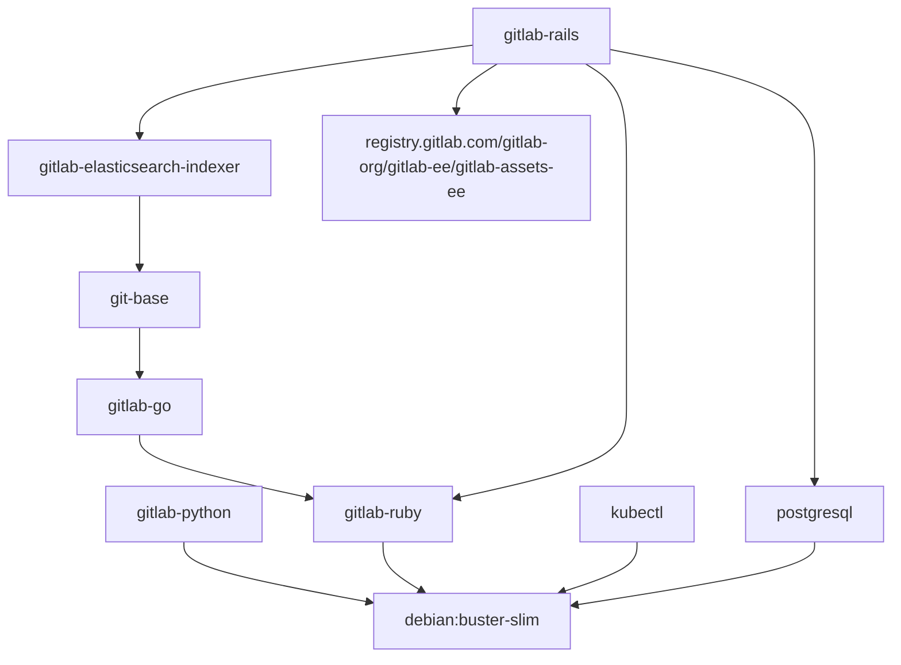
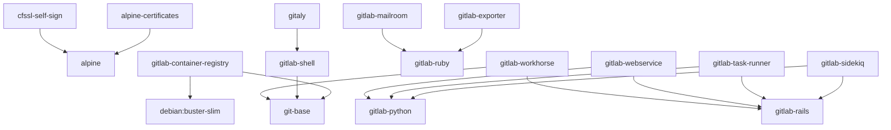

# Building Images

Building these images is done through GitLab CI. By default triggering a CI
build will use the latest upstream gitlab master, and build both gitlab-ce and
gitlab-ee versions.

For releasing new versions, the repo gets tagged by the corresponding GitLab
version by `release-tools` and the tag pipeline running on the dev.gitlab.org
mirror of the project will build the images and push them to dev registry. At
the time of publishing, these images will be copied to the com registry and
hence will be available to the public to use.

## Dependency Proxy
When the variable `DEPENDENCY_PROXY` is set, it will be prefixed to the name of any image which
is pulled from dockerhub.com. To work properly, the variable should be set with the trailing `/`.
The images which currently use this are
1. alpine-certificates
1. cfssl-self-sign
1. gitlab-container-registry
1. gitlab-python
1. kubectl
1. postgresql

## Manually triggering the pipeline for a reference

If manual run of the pipeline needs to be done in order to build/rebuild a particular ref of GitLab,
the build needs to be triggered in this repo's GitLab project with the following variables:

|Variable|Description|Examples|
|--------|-----------|--------|
|`GITLAB_VERSION`|The GitLab ref name used to download the source code. For tags it should be the tag name.|`v11.8.0-ee`, `master`|
|`GITLAB_ASSETS_TAG`|This is used for fetching the js/css assets, and must be the slug version of the *GITLAB_VERSION*.|`v11-8-0-ee`, `11-8-stable-ee`|
|`GITLAB_TAG`|Only provided when the GitLab version is a tagged version. When set this is the tag name.|`v11.8.0-ee`|
|`GITLAB_REF_SLUG`|This is used as the docker label when the new images are built. For tags, this is the tag name. For branches, this is typically the slug version of the branch.|`v11.8.0-ee`, `my-test`|
|`GITALY_SERVER_VERSION`|The version of gitaly to build. This needs to be a tag reference that matches what is in the *GITALY_SERVER_VERSION* file in the version of GitLab being built.|`v1.12.0`|
|`GITLAB_SHELL_VERSION`|The version of gitlab-shell to build. This needs to be a tag reference that matches what is in the *GITLAB_SHELL_VERSION* file in the version of GitLab being built.|`v8.4.4`|
|`GITLAB_WORKHORSE_VERSION`|The version of workhorse to build. This needs to be a tag reference that matches what is in the *GITLAB_WORKHORSE_VERSION* file in the version of GitLab being built.|`v8.3.1`|

**For CE:**

The following variable should be present for a CE build:

- `CE_PIPELINE` - set to `true`

**For EE:**

The following variable should be present for a EE build:

- `EE_PIPELINE` - set to `true`

## UBI images

We provide [UBI](https://www.redhat.com/en/blog/introducing-red-hat-universal-base-image)
images for GitLab components using separate Dockerfiles. These images follow a slightly
different build and release process, detailed below.

### Context

UBI images are provided by creating **Dockerfile.build.ubi8** and/or **Dockerfile.ubi8** files in the
CNG repository for the given component, alongside the standard **Dockerfile**.

- **Dockerfile.build.ubi8** files are required when accessing dependencies over the internet.
- **Dockerfile.ubi8** files are required when creating a final image for use in Kubernetes.
    - If dependencies from the internet are required, they will be pulled from the image
      created from **Dockerfile.build.ubi8**.

The presence of these files will trigger the UBI image build, given one of the following conditions is met:

- The pipeline is running for a tag ending in `-ubi8`, or
- The pipeline is running for a branch name ending in `-ubi8`, or
- The pipeline is running with an environment variable matching `UBI_PIPELINE='true'`

If one of these conditions is met, additional pipeline jobs and stages will appear and the UBI
images will be built and pushed.

### Offline builds

UBI-based images can be built in an isolated environment with limited access to the internet.
In such an environment, the build scripts must download the binary dependencies from
[GitLab CNG Releases](https://gitlab.com/gitlab-org/build/CNG/-/releases). They also need
access the official UBI software repositories.

### Build stages

The CNG images can be built in three stages. This is because some images use the images
from prior stages as their base. Not all the CNG images are final images. Some are
intermediates that are only used as base images. The following list shows the stages and
the purpose of the image (intermediate vs. final or both). Please note that all images
in one stage can be built concurrently. They do not depend on each other.

**Stage I**
  * kubectl (intermediate, final)
  * gitlab-ruby (intermediate)
  * gitlab-container-registry (final)

**Stage II**
  * git-base (intermediate)
  * gitlab-exporter (final)
  * gitlab-mailroom (final)
  * gitlab-shell (final)
  * gitlab-rails (intermediate, final)
  * gitlab-workhorse (final)

**Stage III**
  * gitlab-geo-logcursor (final)
  * gitlab-sidekiq (final)
  * gitlab-task-runner (final)
  * gitlab-webservice (final)

The rule of thumb is that majority of final images have `LABEL` and `USER` Docker build
instructions.

To build the UBI-based images in an isolated/controlled environment you need to download,
verify, and extract binary dependencies into Docker build contexts. Docker build instructions
for UBI-based images assume that these dependencies are placed in the right locations in the
Docker build context. Failing to do so breaks the build process.

The helper scripts in `build-scripts/ubi-offline/` directory help you with offline build.

`prepare.sh` downloads, verifies, and extracts the binary dependencies into the right places.
It ensures that all required dependencies for building UBI-based images are available in
the Docker build context. You can run this script from any location. To use it, you need to
pass the release tag, e.g. `prepare.sh v12.5.0-ubi8`. This script uses `curl`, `gpg`, and `tar`
commands.

`build.sh` builds all UBI-based images in the order that is described above. It logs the Docker
build output in `.out` files and keeps track of the failed images in `failed.log` . You can run
this script from any location however it always logs the outputs in `build-scripts/ubi-offline/build`.
Please note that you need to run `prepare.sh` before running this script.

`cleanup.sh` removes all the cached binary dependencies and log files that were generated or
downloaded by `prepare.sh` and `build.sh`. Same as the other two scripts you you can run this
script from any location.

## Build dependencies

We use a layered build process to speed up build time, and reduce the size of our images. This does result in a complicated set of relationships between the images we build during build time.

### Intermediate images

### Final images

